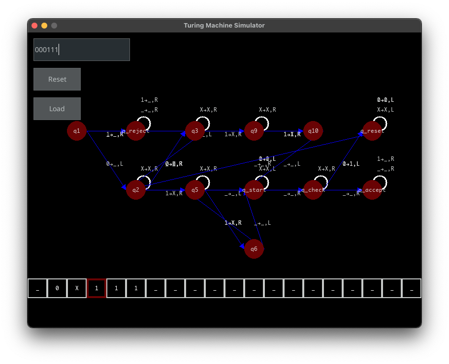

# Turing Machine Simulator

<p align="center">
  
</p>

<!-- @import "[TOC]" {cmd="toc" depthFrom=2 depthTo=2 orderedList=false} -->

<!-- code_chunk_output -->

- [Overview](#overview)
- [Features](#features)
- [Installation](#installation)
- [Usage](#usage)
- [Project Structure](#project-structure)
- [Contributing](#contributing)
- [License](#license)
- [Examples](#examples)

<!-- /code_chunk_output -->

## Overview

This Turing Machine Simulator is a graphical application built using Python and the Pygame library. It allows users to simulate the operation of a Turing machine, a fundamental model in theoretical computer science for algorithms and computation. Users can load transition rules from a CSV file, visualize the Turing machine's tape, and observe the machine's state transitions graphically in real-time.

This repository also includes a summery of important languages and proofs from the book "Introduction to the Theory of Computation" by Michael Sipser. The goal is to provide a visual representation of the concepts and languages presented in the book, and to help students understand the theoretical concepts of computation and automata.

## Features

- **Graphical User Interface**: The simulator features a fully interactive GUI built with Pygame, making it easy to manage and visualize the Turing machine's operations.
- **Transition Loading**: Users can load custom transitions for the Turing machine from CSV files to define how the machine processes input.
- **Real-time Simulation**: The application simulates the Turing machine in real-time, showing the tape, current state, and read/write head movements.
- **State Transition Graph**: The simulator dynamically generates and displays the state transition graph, illustrating the paths that the machine can take during its operation.

## Installation

### Prerequisites

Before you can run the Turing Machine Simulator, you need to have Python and Pygame installed on your machine. Python 3.6 or higher is recommended. You can download Python from [python.org](https://www.python.org/downloads/), and Pygame can be installed using pip:

```bash
pip install pygame
pip install pygame_gui
```

### Running the Application

To run the Turing Machine Simulator, you can clone this repository and execute the `main.py` script:

```bash
python3 main.py
```

## Usage

- **Start the Simulator**: Launch the application as described above. The main window will open with an empty tape and a default starting state.
- **Load Transitions**: Click the 'Load' button and select a CSV file with the transition rules. The format of the CSV should be `current_state,input_symbol,next_state,output_symbol,direction`.
- **Reset the Machine**: If you need to reset the simulator at any point, simply click the 'Reset' button. This will clear the input and return the machine to its initial state.
- **Simulate Input Processing**: After loading the transitions and setting the input on the tape, use the control buttons or keyboard arrows to step through the simulation.

## Project Structure

- **`turing_machine_app.py`**: Main application file containing the GUI and event loop.
- **`turing_machine.py`**: Defines the Turing machine logic and operations.
- **`turing_machine_graph.py`**: Manages the graphical representation of the state transition graph.
- **`particlesystem.py`**: A simple particle system for visual effects.
- **`utils.py`**: Utility functions, including CSV file loading.
- **`config.py`**: Configuration file containing constants like screen size and colors.

## Contributing

Contributions to the Turing Machine Simulator are welcome! Please feel free to fork the repository, make changes, and submit pull requests. You can also open issues for bugs you've found or features you think would be useful.

## License

This project is licensed under the MIT License - see the [LICENSE.md](LICENSE.md) file for details.

## Examples

### $0^{3^n}$ language

The following examples show the operation of a Turing machine that recognizes the language of $0^{3^n}$, where $n$ is a non-negative integer. The concept of operation is based on dividing the input tape each time by 3, by crossing out every 2 zero in a group of 3. The machine keeps track only of the remainder of the division by 3, and if the input tape is all crossed out, the machine accepts the input.

<p align="center">
  <i>Example of a TM that recognizes the language of 3 pow</i>
  <br>
  
</p>


### Palindrome language

The following example demonstrates a Turing machine that recognizes palindromes. The machine works by "zig-zag" from the beginning and end of the input tape, comparing the symbols at each end. If the symbols match, the machine keeps moving towards the center of the tape. If the symbols differ, the machine rejects the input. If the machine reaches the center of the tape and all symbols match, it accepts the input as a palindrome.

<p align="center">
    <i>Example of a TM that recognizes palindromes</i>
    <br>
  
</p>
