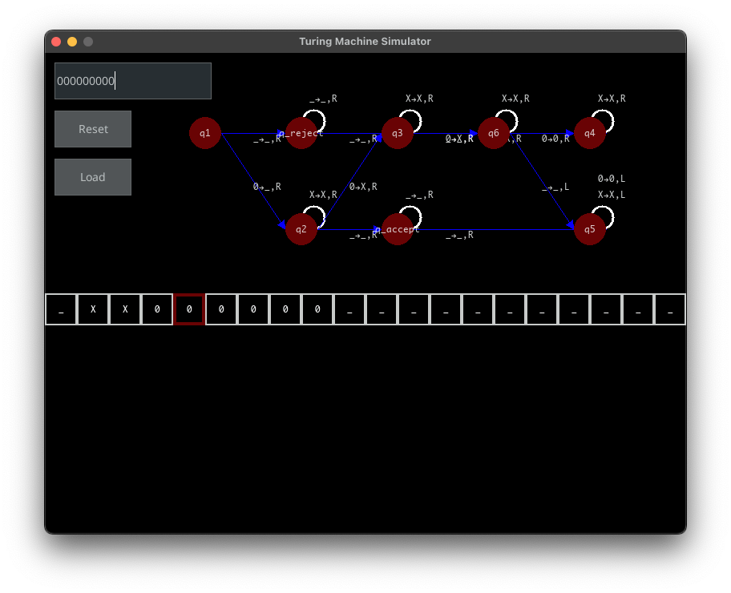
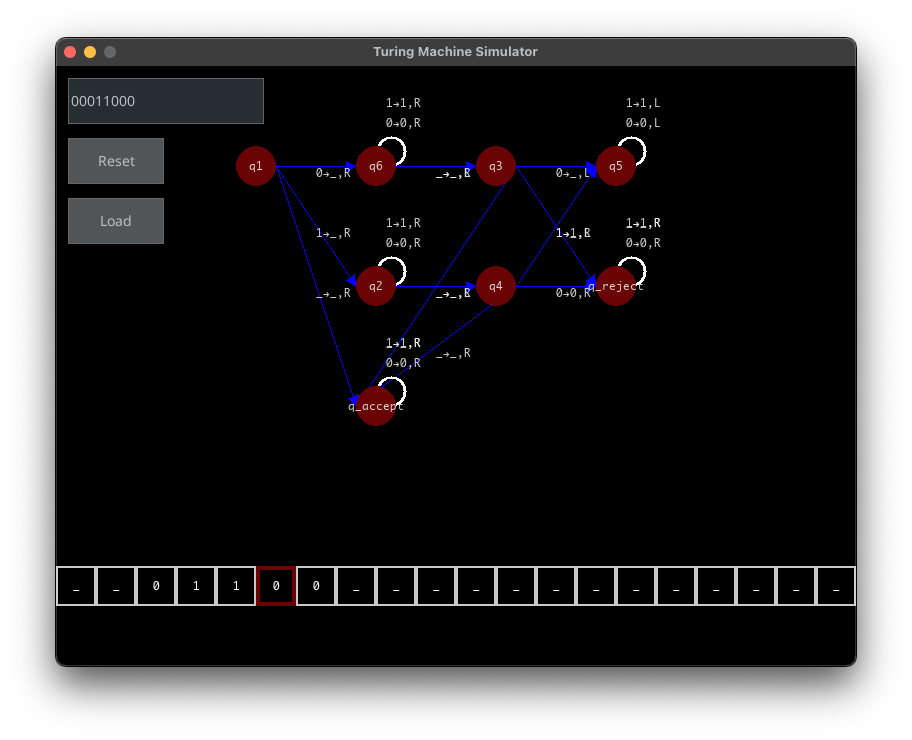

# Turing Machine Simulator

This is a simple Turing Machine simulator written in Python. It feautures a graphical interface that allows you to create, edit and run Turing Machines. The simulator includes a few example machines to get you started: a TM for recognizing palindromes and a TM for regonize the language $0^{3^n}$.

  
  <i>Example of a TM that recognizes the language $0^{3^n}$</i>

  
    <i>Example of a TM that recognizes palindromes</i>

