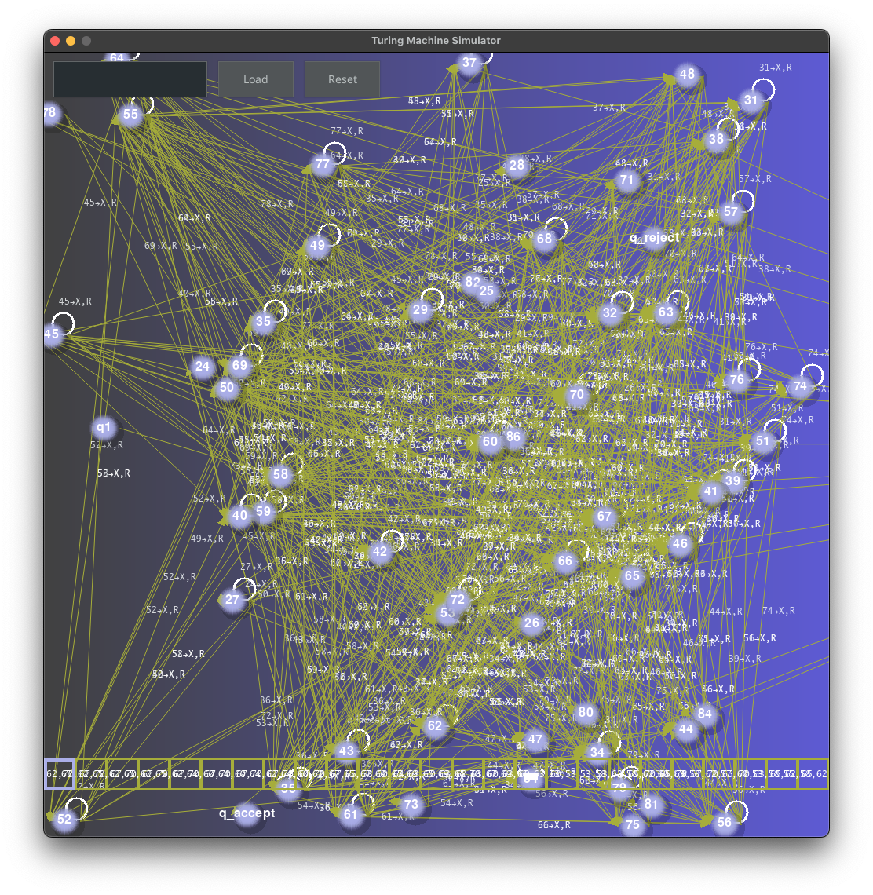

# Turing Machine Simulator (AudioVisualSynth Integration)

<p align="center">
  <table align="center">
    <tr>
      <td></td>
      <td></td>
    </tr>
    <tr>
      <td></td>
      <td></td>
    </tr>
  </table>
</p>

- [Overview](#overview)
- [Features](#features)
- [Installation](#installation)
- [Usage](#usage)
  - [Main Components](#main-components)
  - [Running the Simulator](#running-the-simulator)
- [File Structure](#file-structure)
- [Examples](#examples)
- [Music](#music)
- [Code Explanation](#code-explanation)
  - [MIDI to Turing Machine Conversion](#midi-to-turing-machine-conversion)
  - [Drawing the Turing Machine GraphThe](#drawing-the-turing-machine-graphthe)
- [Contributing](#contributing)
- [License](#license)
- [Acknowledgements](#acknowledgements)

## Overview

This project is a Turing Machine simulator featuring a graphical user interface (GUI) built using the Pygame library. The simulator visualizes the operation of a Turing Machine, displaying state transitions and tape movements, and incorporates a simple particle system for visual effects.

### Non-Musical Turing Machine for Palindromic Languages and $0^{{3}^{n}}$ Languages
[Watch the video here](https://github.com/Dor-sketch/TM/assets/138825033/c7e489f6-9cc6-482a-b8ba-52ea8af576f6)

## Features

- **Turing Machine Simulation**: Simulates a Turing Machine with customizable states and transitions.
- **Graphical Interface**: Uses Pygame to display the Turing Machine tape, head, and state transitions.
- **Particle System**: Adds visual effects to the simulation.
- **MIDI Integration**: Converts MIDI files into Turing Machine transitions.
- **CSV Loading**: Load Turing Machine transitions from CSV files.
- **Dynamic Graph Theme**: Changes the theme of the state transition graph based on the current time.

## Installation

1. **Clone the repository**:

    ```sh
    git clone https://github.com/Dor-sketch/TM.git
    cd TM
    ```

2. **Install dependencies**:

    ```sh
    pip install -r requirements.txt
    ```

    To generate notes, clone my other repository [AudioVisualSynth](https://github.com/Dor-sketch/AudioVisualSynth) and follow the instructions in the README.

    Alternatively, you can just use the `music.py` from the `AudioVisualSynth` repository to generate notes.

3. **Run the simulator**:

    ```sh
    python turing_machine_app.py
    ```

## Usage

### Main Components

- **TuringMachineApp**: The main application class that initializes the GUI and handles events.
- **ParticleSystem**: Manages and updates particles for visual effects.
- **TuringGraph**: Draws the state transition graph of the Turing Machine.
- **midi_to_tm**: Converts MIDI files into Turing Machine transitions.

### Running the Simulator

1. **Launch the simulator**:

    ```sh
    python turing_machine_app.py
    ```

2. **Load Transitions**: Use the `Load` button to load transitions from a CSV or MIDI file.

3. **Reset the Machine**: Use the `Reset` button to reset the Turing Machine to its initial state.

4. **Input**: Enter an input string for the Turing Machine in the provided text box.

5. **Run the Simulation**: Use keyboard controls (`Arrow Keys`) to step through the simulation.

## File Structure

- `turing_machine_app.py`: Main application code.
- `particle_system.py`: Contains the particle system and particle classes.
- `turing_machine.py`: Defines the Turing Machine class.
- `turing_machine_graph.py`: Manages the state transition graph drawing.
- `miditm.py`: Converts MIDI files to Turing Machine transitions.
- `utils.py`: Utility functions for loading transitions from CSV and generating colors.
- `config.py`: Configuration constants for the application.
- `input_string.txt`: Default input string for the Turing Machine.
- `mids/`: Directory containing example MIDI files for testing (my own compositions).
- `csvs/`: Directory containing example CSV files for testing.
- `images/`: Directory containing images for the README.

## Examples

To see the Turing Machine in action, load an example MIDI or CSV file and start the simulation. Observe how the Turing Machine processes the input and moves through its states while particles provide visual feedback.

## Music

### Ed Sheeran - Photograph
[Watch here](https://github.com/Dor-sketch/TM/assets/138825033/f9c2e540-ec35-44a8-b9ef-0a51ac3b74f0)

### M83 - Midnight City
[Watch here](https://github.com/Dor-sketch/TM/assets/138825033/b08ecd4e-6771-47fd-aa13-cd1e50ea250b)

### Green Day - Boulevard of Broken Dreams
[Watch here](https://github.com/Dor-sketch/TM/assets/138825033/ff996125-f73e-4299-ac27-0b599540e7d5)

### 3 Doors Down - Here Without You
[Watch here](https://github.com/Dor-sketch/TM/assets/138825033/0f7c9902-d982-450f-aef7-7ecf8d940968)

### Hans Zimmer - Time (Version 1)
[Watch here](https://github.com/Dor-sketch/TM/assets/138825033/c86cc5db-5e7d-46a5-b50e-7304474aa5d3)

### Hans Zimmer - Time (Version 2)
[Watch here](https://github.com/Dor-sketch/TM/assets/138825033/990c8c49-ec03-4d21-81f4-0b32ad326142)

### Owl City - Fireflies
[Watch here](https://github.com/Dor-sketch/TM/assets/138825033/20a33769-e3d8-459b-ae3d-9bfd945b7f65)

### Evanescence - My Immortal
[Watch here](https://github.com/Dor-sketch/TM/assets/138825033/592520a6-2a6e-47cf-9abd-7ef2a63c7c16)

## Code Explanation

### MIDI to Turing Machine Conversion

The `midi_to_tm` function in `miditm.py` converts a MIDI file to a Turing Machine. It processes `note_on` and `note_off` messages to create states and transitions for the Turing Machine.

```python
import mido
from turing_machine import TuringMachine, DEFAULT_INPUT_SYMBOLS, DEFAULT_TAPE_SYMBOLS

def initialize_variables():
    states = set(['q1', 'q_accept', 'q_reject'])
    transitions = {'q1': {}, 'q_accept': {}, 'q_reject': {}}
    first_note = None
    last_note = None
    input_string = []
    note_on_time = {}
    tempo = mido.bpm2tempo(60)
    prev_note = None
    chord = []
    prev_time = 0
    current_time = 0
    return states, transitions, first_note, last_note, input_string, note_on_time, tempo, prev_note, chord, prev_time, current_time

def process_note_on(msg, filter, current_time, prev_time, chord, input_string, first_note, last_note, states, transitions, prev_note, note_on_time):
    if filter and (msg.note < 50 or msg.note > 81):
        return prev_time, chord, first_note, last_note, states, transitions, prev_note
    note_str = str(msg.note)
    note_on_time[note_str] = current_time
    if prev_time != current_time:
        if chord:
            input_string.append(','.join(chord))
            chord = []
        prev_time = current_time
    chord.append(note_str)
    if first_note is None:
        first_note = note_str
    last_note = note_str
    states.add(note_str)
    if note_str not in transitions:
        transitions[note_str] = {}
    if prev_note is not None:
        transitions[prev_note][note_str] = (note_str, 'X', 'R')
    prev_note = note_str
    return prev_time, chord, first_note, last_note, states, transitions, prev_note

def process_note_off(msg, current_time, note_on_time):
    note_str = str(msg.note)
    if note_str in note_on_time:
        del note_on_time[note_str]

def midi_to_tm(midi_file, filter=False):
    mid = mido.MidiFile(midi_file)
    states, transitions, first_note, last_note, input_string, note_on_time, tempo, prev_note, chord, prev_time, current_time = initialize_variables()
    for msg in mid:
        if msg.type == 'set_tempo':
            tempo = msg.tempo
        current_time += mido.tick2second(msg.time, mid.ticks_per_beat, tempo)
        if msg.type == 'note_on':
            prev_time, chord, first_note, last_note, states, transitions, prev_note = process_note_on(msg, filter, current_time, prev_time, chord, input_string, first_note, last_note, states, transitions, prev_note, note_on_time)
        if msg.type == 'note_off':
            process_note_off(msg, current_time, note_on_time)
    if chord:
        input_string.append(','.join(chord))
    transitions['q1'][first_note] = (first_note, 'X', 'R')
    transitions[last_note]['q_accept'] = ('q_accept', 'X', 'R')
    input_string = ' '.join(input_string)
    with open('input_string.txt', 'w') as f:
        f.write(input_string)
    return TuringMachine(states, DEFAULT_INPUT_SYMBOLS, DEFAULT_TAPE_SYMBOLS, transitions)
```

### Drawing the Turing Machine GraphThe

`TuringGraph` class in `turing_machine_graph.py` is responsible for drawing the Turing Machine's state transition graph using Pygame. It includes methods to set the theme, draw states and transitions, and calculate node positions.

```python
import math
import random
import time
from collections import deque
import pygame
import pygame.gfxdraw
from PIL import Image, ImageDraw
from config import SCREEN_WIDTH, SCREEN_HEIGHT, STATE_COLOR, TEXT_COLOR, LINES_COLOR, font, palettes

class TuringGraph:
    def __init__(self, states, transitions):
        self.line_color = LINES_COLOR
        self.circle_color = STATE_COLOR
        self.text_color = TEXT_COLOR
        self.graph = pygame.Surface((SCREEN_WIDTH, SCREEN_HEIGHT))
        self.states_list = list(states)
        self.transitions = transitions
        self.positions = {state: (random.uniform(0, SCREEN_WIDTH), random.uniform(0, SCREEN_HEIGHT)) for state in self.states_list}
        self.init_positions()
        self.generate_graph()

    def set_theme(self):
        t = time.time()
        palette_index = int(t / 10) % len(palettes)
        color_index1 = int(t) % len(palettes[palette_index])
        color_index2 = (color_index1 + 1) % len(palettes[palette_index])
        color1 = palettes[palette_index][color_index1]
        color2 = palettes[palette_index][color_index2]
        gradient = Image.new('RGB', self.graph.get_size())
        draw = ImageDraw.Draw(gradient)
        for i in range(self.graph.get_width()):
            r = color1[0] * (1 - i/self.graph.get_width()) + color2[0] * (i/self.graph.get_width())
            g = color1[1] * (1 - i/self.graph.get_width()) + color2[1] * (i/self.graph.get_width())
            b = color1[2] * (1 - i/self.graph.get_width()) + color2[2] * (i/self.graph.get_width())
            draw.line([(i, 0), (i, self.graph.get_height())], fill=(int(r), int(g), int(b)))
        gradient_pygame = pygame.image.fromstring(gradient.tobytes(), gradient.size, gradient.mode)
        self.graph.blit(gradient_pygame, (0, 0))
        self.line_color = (255 - color2[0], 255 - color2[1], 255 - color2[2])
        self.circle_color = ((255 + color2[0]) // 2, (255 + color2[1]) // 2, (255 + color2[2]) // 2)

    def generate_graph(self):
        self.set_theme()
        drawn = {}
        self.draw_transitions(drawn)
        self.draw_states()

    def draw_transitions(self, drawn):
        for state, transitions in self.transitions.items():
            for symbol, (next_state, write_symbol, move_direction) in transitions.items():
                if state == next_state:
                    self.draw_loop(state, drawn, symbol, write_symbol, move_direction)
                else:
                    self.draw_line(state, next_state, symbol, write_symbol, move_direction)

    def draw_loop(self, state, drawn, symbol, write_symbol, move_direction):
        if state in drawn:
            x, y = drawn[state]
            self.blit_text(x, y - 20, symbol, write_symbol, move_direction)
        else:
            x, y = self.positions[state]
            self.draw_arc(x, y)
            self.blit_text(x + 10, y - 50, symbol, write_symbol, move_direction)
            drawn[state] = (x, y)

    def draw_arc(self, x, y):
        rect = pygame.Rect(x, y - 30, 30, 30)
        start_angle = math.pi / 2
        stop_angle = 2.5 * math.pi
        pygame.draw.arc(self.graph, self.text_color, rect, start_angle, stop_angle, width=2)

    def draw_line(self, state, next_state, symbol, write_symbol, move_direction):
        start_x, start_y = self.positions[state]
        end_x, end_y = self.positions[next_state]
        start_x += 20
        end_x -= 20
        pygame.draw.aaline(self.graph, self.line_color, (start_x, start_y), (end_x, end_y))
        self.draw_arrow(start_x, start_y, end_x, end_y)
        self.blit_text((start_x + end_x) / 2, (start_y + end_y) / 2, symbol, write_symbol, move_direction)

    def draw_arrow(self, start_x, start_y, end_x, end_y):
        dx = end_x - start_x
        dy = end_y - start_y
        angle = math.atan2(dy, dx)
        ARROW_LENGTH = 10
        ARROW_dx = ARROW_LENGTH * math.cos(angle)
        ARROW_dy = ARROW_LENGTH * math.sin(angle)
        ARROW_point1 = (end_x - ARROW_dx + ARROW_dy / 2, end_y - ARROW_dy - ARROW_dx / 2)
        ARROW_point2 = (end_x - ARROW_dx - ARROW_dy / 2, end_y - ARROW_dy + ARROW_dx / 2)
        pygame.draw.polygon(self.graph, self.line_color, [(end_x, end_y), ARROW_point1, ARROW_point2])

    def blit_text(self, x, y, symbol, write_symbol, move_direction):
        text_surface = font.render(f"{symbol}{ARROW}{write_symbol},{move_direction}", True, self.text_color)
        text_surface.set_alpha(200)
        text_surface.set_colorkey((0, 255, 0))
        self.graph.blit(text_surface, (x, y))

    def draw_states(self):
        for state in self.states_list:
            x, y = self.positions[state]
            self.draw_3d_circle(self.graph, x, y, 20, self.circle_color, text=state, text_color=self.text_color)

    def draw_3d_circle(self, surface, x, y, radius, color, text=None, text_color=(255, 255, 255)):
        x, y, radius = int(x), int(y), int(radius)
        shadow_color = (0, 0, 0, 50)
        pygame.gfxdraw.filled_circle(surface, x + radius // 4, y + radius // 4, radius, shadow_color)
        for i in range(radius):
            alpha = round(255 * (i / radius))
            pygame.gfxdraw.filled_circle(surface, x, y, radius - i, (*color, alpha))
        if text is not None:
            font = pygame.font.Font(None, 24)
            text_surface = font.render(text, True, text_color)
            text_rect = text_surface.get_rect(center=(x, y))
            surface.blit(text_surface, text_rect)

    def init_positions(self):
        num_layers, max_nodes_in_layer = self.calculate_layers_and_nodes()
        SPACING_X, SPACING_Y, MARGIN_X, MARGIN_Y = self.calculate_spacing(num_layers, max_nodes_in_layer)
        visited, queue, layer_nodes = self.initialize_queue()
        while queue:
            state, layer = queue.popleft()
            if not visited[state]:
                visited[state] = True
                self.update_positions(state, layer, SPACING_X, SPACING_Y, MARGIN_X, layer_nodes)
                for next_state in self.transitions[state].values():
                    queue.append((next_state[0], layer + 1))

    def calculate_layers_and_nodes(self):
        self.start_state = 'q1'
        visited = {state: False for state in self.states_list}
        queue = deque([(self.start_state, 0)])
        layer_nodes = {}
        max_layer = 0
        max_nodes_in_layer = 0
        while queue:
            state, layer = queue.popleft()
            if not visited[state]:
                visited[state] = True
                layer_nodes.setdefault(layer, []).append(state)
                max_layer = max(max_layer, layer)
                max_nodes_in_layer = max(max_nodes_in_layer, len(layer_nodes[layer]))
                for next_state in self.transitions[state].values():
                    queue.append((next_state[0], layer + 1))
        return max_layer + 1, max_nodes_in_layer

    def calculate_spacing(self, num_layers, max_nodes_in_layer):
        SPACING_X = SCREEN_WIDTH // (num_layers + 1)
        SPACING_Y = SCREEN_HEIGHT // (max_nodes_in_layer + 1)
        MARGIN_X = SPACING_X
        MARGIN_Y = SPACING_Y * 2
        return SPACING_X, SPACING_Y, MARGIN_X, MARGIN_Y

    def initialize_queue(self):
        self.start_state = 'q1'
        visited = {state: False for state in self.states_list}
        queue = deque([(self.start_state, 0)])
        layer_nodes = {}
        return visited, queue, layer_nodes

    def update_positions(self, state, layer, SPACING_X, SPACING_Y, MARGIN_X, layer_nodes):
        x = MARGIN_X + layer * SPACING_X
        num_nodes_in_layer = len(layer_nodes.get(layer, []))
        layer_height = SPACING_Y * (num_nodes_in_layer - 1)
        start_y = (SCREEN_HEIGHT - layer_height) // 2
        for i, state in enumerate(layer_nodes.get(layer, [])):
            y = start_y + i * SPACING_Y
            self.positions[state] = (x, y)
        layer_nodes.setdefault(layer, []).append(state)
```


## Contributing

Contributions are welcome! Please fork the repository and create a pull request with your changes.

## License

This project is licensed under the MIT License. See the `LICENSE` file for details.

## Acknowledgements

- The Pygame library for providing the foundation for the GUI.
- The Pygame GUI extension for handling UI elements.
- The `mido` library for helping with MIDI file processing.
